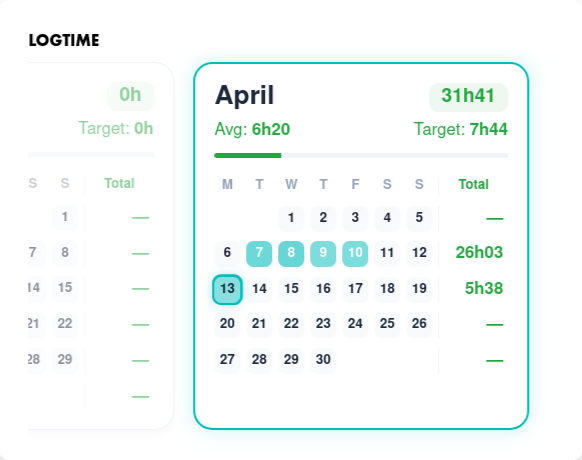

# 42 Userscripts
Userscripts to improve UI and UX of the 42 Intra v3

## [Userscripts](#Userscripts)

### [logtime.user.js](https://raw.githubusercontent.com/nicopasla/42-userscripts/main/logtime.user.js)

Redesign of the logtime calendar to show weekly and total hours

- Target is calculated on week days with the `goal_hours`
- Average is also calculated on week days
- Data is from `locations_stats` loaded when a profile is loaded

## Installation

1. Install [Tampermonkey](https://www.tampermonkey.net/) or [Violentmonkey](https://violentmonkey.github.io/) for your browser
2. Open any link in the [Userscripts](#Userscripts) section. Your userscript manager will prompt you to install it.

## Disclaimer
This extension is a personal project that only change the style of the website

## License

MIT